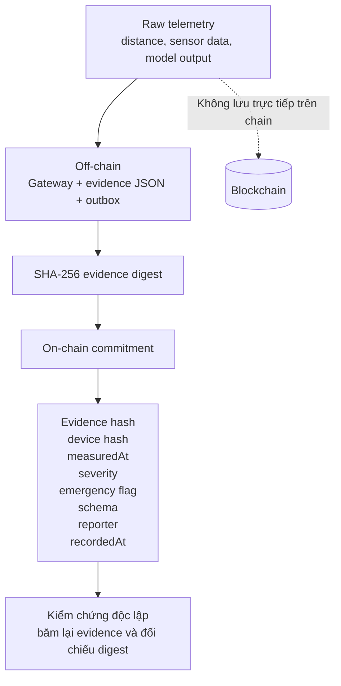
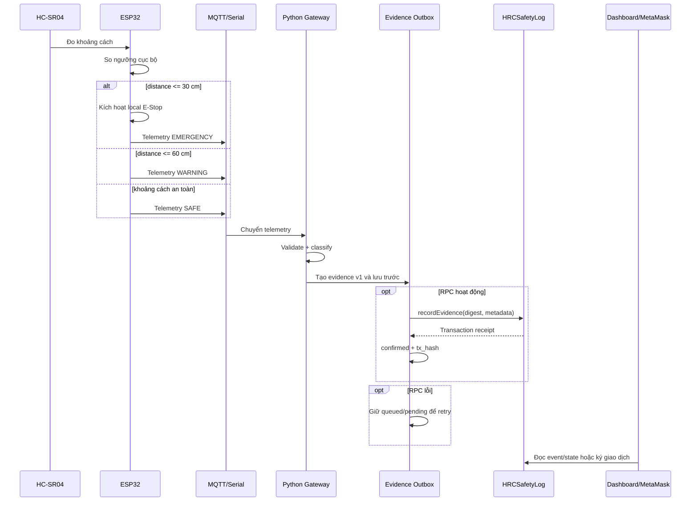

# Sơ đồ khối hệ thống SonarChain HRC Safety Log

## 1. Kiến trúc tổng thể

```mermaid
flowchart LR
    subgraph EDGE[Thiết bị tại edge]
        S[HC-SR04<br/>Đo khoảng cách]
        E[ESP32<br/>Safety decision cục bộ]
        R[Local E-Stop<br/>Dừng fail-safe tại edge]
        S --> E
        E --> R
    end

    subgraph TRANSPORT[Kênh truyền telemetry]
        USB[USB Serial<br/>115200 baud]
        MQTT[MQTT publish]
        B[ Mosquitto Broker<br/>127.0.0.1:1883 ]
        E --> USB
        E --> MQTT
        MQTT --> B
    end

    subgraph GATEWAY[Gateway / xử lý off-chain]
        SR[Serial reader]
        MS[MQTT subscriber]
        P[Safety pipeline<br/>validate + classify]
        EV[Evidence envelope v1<br/>Canonical JSON + SHA-256]
        O[Durable outbox<br/>data/evidence_outbox/*.json]
        SR --> P
        B --> MS
        MS --> P
        P --> EV
        EV --> O
    end

    USB --> SR
    O -->|RPC submit / retry| C

    subgraph CHAIN[Blockchain local / EVM]
        C[HRCSafetyLog<br/>evidence commitment]
        W[WorkPermitHandoff<br/>permit + handoff ledger]
        C --> L[(On-chain state<br/>events / reporter / E-Stop latch)]
        W --> WL[(Permit state<br/>PENDING → APPROVED → ACTIVE → COMPLETED)]
    end

    subgraph UI[Người vận hành]
        D[SonarChain Dashboard<br/>localhost:8080]
        M[MetaMask<br/>Hardhat Local · chain 31337]
        D <-->|ethers.js / transaction| M
        M --> C
        M --> W
    end

    C -.->|tx hash / event / state| D
    W -.->|permit status / events| D
```

## 2. Ranh giới dữ liệu

## 3. Luồng xử lý safety event

## 4. Ý nghĩa các khối

| Khối | Vai trò |
|---|---|
| HC-SR04 | Đo khoảng cách vật thể/người với robot. |
| ESP32 | Đọc cảm biến và giữ quyết định safety thời gian thực tại edge. |
| Local E-Stop | Cơ chế dừng cục bộ; không phụ thuộc MQTT, RPC hoặc blockchain. |
| Serial | Kênh USB hiện có để đọc telemetry từ ESP32. |
| MQTT broker | Trung gian truyền telemetry; bản local dùng Mosquitto. |
| Python gateway | Nhận telemetry, kiểm tra dữ liệu và phân loại SAFE/WARNING/EMERGENCY. |
| Evidence envelope | JSON versioned được canonicalize và băm SHA-256. |
| Outbox | Lưu evidence bền vững trước khi submit; hỗ trợ retry khi RPC lỗi. |
| HRCSafetyLog | Lưu commitment và metadata safety trên blockchain. |
| WorkPermitHandoff | Quản lý permit, supervisor approval, zone entry và handoff. |
| MetaMask | Ví ký transaction của owner/reporter/supervisor/gateway. |
| Dashboard | Hiển thị telemetry mô phỏng, trạng thái, event và workflow Web3. |

## 5. Điểm cần nhấn mạnh khi demo

Blockchain là lớp audit/evidence và coordination. Nó không chứng minh cảm biến đo chính xác, không điều khiển motor và không thay thế local E-Stop. Nếu RPC hoặc MQTT bị lỗi, quyết định dừng cục bộ tại ESP32/gateway vẫn phải hoạt động; evidence được giữ trong outbox để xử lý lại sau.
